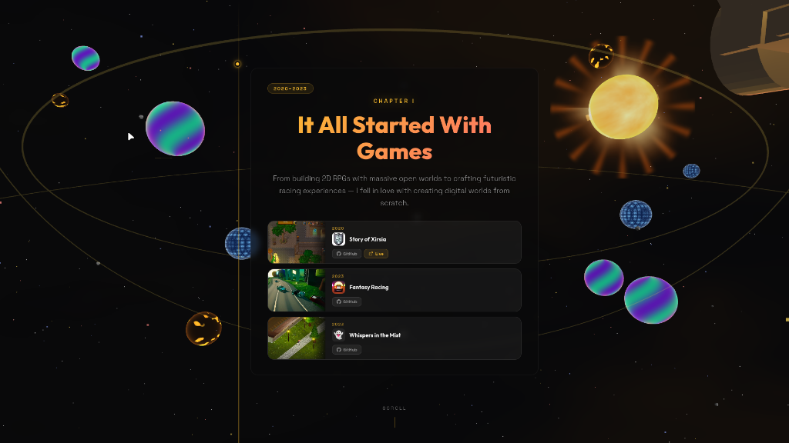

# Abhay Raj — Portfolio

A stunning 3D portfolio website built with React + Three.js (React Three Fiber), featuring a scroll-driven cinematic intro through space with custom GLSL shaders, orbital planets, and a glowing sun.

🌐 **Live:** [abhay-byte.web.app](https://abhay-byte.web.app)



## ✨ Features

- **3D Space Intro** — Scroll-driven storytelling with a racing car flying through space
- **Custom Shaders** — Aurora, lava, and ice planet materials + sun with corona flares
- **Animated Planets** — 10 planets with orbital motion and scale pulsing
- **Sun with Solar Flares** — Dynamic sun with animated flare rays and breathing effects
- **Chapter Timeline** — Interactive project timeline with videos and screenshots
- **Nebula & Particles** — Floating debris, shooting stars, glow dust, and nebula backdrop
- **Premium Dark Theme** — Gruvbox-inspired accent colors with glassmorphism effects

## 🛠 Tech Stack

- **Vite** + **React**
- **Three.js** via React Three Fiber + Drei
- **Custom GLSL Shaders** for planets, sun, overlays, and nebula
- **Firebase Hosting** for deployment

## 🚀 Development

```bash
npm install
npm run dev
```

## 📦 Build & Deploy

```bash
npm run build
npx firebase deploy --only hosting
```

## 📄 License

MIT
